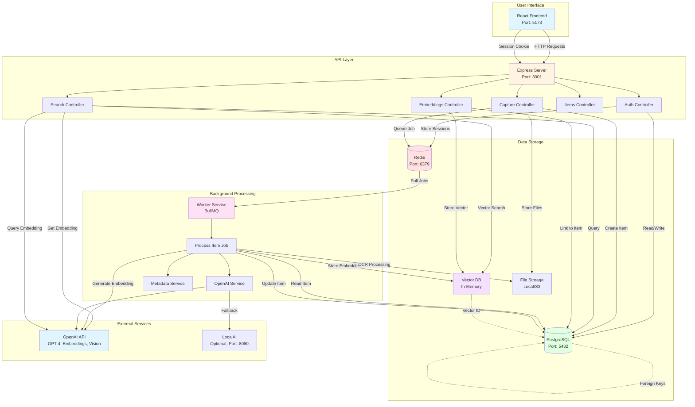

# System Design - Project Synapse

## Overview

Project Synapse is an intelligent second brain application that helps users capture, organize, and retrieve information using AI-powered semantic search. The system is built as a microservices architecture with three main components: a React frontend, an Express.js API server, and a background worker service.

## Architecture

The application follows a three-tier architecture:

1. **Frontend (Client)**: React-based web interface for user interaction
2. **Backend (Server)**: RESTful API that handles requests and manages data
3. **Worker**: Background service that processes items asynchronously

All services communicate through:
- **PostgreSQL**: Primary database for structured data
- **Redis**: Job queue and session storage
- **Vector Database**: In-memory vector store for semantic search (production-ready for Qdrant/Pinecone)

## System Architecture Diagram



### Component Interaction Flow

#### 1. Content Capture Flow
```
User → Frontend → API Server → PostgreSQL (create item)
                    ↓
                 Redis Queue → Worker → Process Item
                                      ↓
                    OpenAI API → Generate Summary/Embedding
                                      ↓
                    Vector DB ← Store Embedding
                                      ↓
                    PostgreSQL ← Update Item Status
```

#### 2. Search Flow
```
User Query → Frontend → API Server
                          ↓
                    Query Expansion
                          ↓
              ┌──────────┴──────────┐
              ↓                     ↓
        Semantic Search      Keyword Search
              ↓                     ↓
        OpenAI API            PostgreSQL
        (Embedding)           (Text Match)
              ↓                     ↓
        Vector DB                   │
              └──────────┬──────────┘
                         ↓
                  Hybrid Ranking
                         ↓
                    Return Results
```

#### 3. Authentication Flow
```
User Login → API Server → PostgreSQL (validate)
                          ↓
                    Redis (store session)
                          ↓
                    Return Cookie
                          ↓
        Subsequent Requests → Validate Session
```

## Core Services

### 1. Authentication Service
**Location**: `server/src/services/auth.ts`, `server/src/controllers/auth.ts`

Handles user authentication and session management:
- User registration with email/password
- Secure login with bcrypt password hashing
- Session management using Redis
- Password change functionality
- Profile updates

**Tech Stack**: Express.js, bcrypt, Redis (for sessions), Prisma ORM

### 2. Capture Service
**Location**: `server/src/controllers/capture.ts`, `capture-link.ts`, `capture-file.ts`

Manages content capture from multiple sources:
- **Text Notes**: Direct text input with instant storage
- **Links**: URL capture with metadata extraction
- **Files**: Image and document uploads with local storage

**Tech Stack**: Express.js, Multer (file uploads), Prisma ORM

### 3. Processing Worker
**Location**: `worker/src/jobs/process-item.ts`

Background job processor that enriches captured content:
- **Text Analysis**: Uses OpenAI to generate summaries and classify content types
- **Link Processing**: Fetches metadata (Open Graph, Twitter Cards), extracts content
- **Image Processing**: OCR text extraction using Tesseract.js, vision model descriptions
- **Embedding Generation**: Creates vector embeddings for semantic search

**Tech Stack**: BullMQ, Redis, OpenAI API, Tesseract.js, Prisma ORM

### 4. Search Service
**Location**: `server/src/controllers/search.ts`, `server/src/services/vector-db.ts`, `server/src/services/query-expansion.ts`

Hybrid search system combining semantic and keyword search:
- **Query Expansion**: Rewrites natural language queries for better understanding
- **Semantic Search**: Vector similarity search using embeddings
- **Keyword Search**: Traditional text matching as fallback
- **Hybrid Ranking**: Combines both methods with weighted scoring

**Tech Stack**: OpenAI Embeddings API, Cosine Similarity, Prisma ORM

### 5. Vector Database Service
**Location**: `server/src/services/vector-db.ts`

Manages vector embeddings for semantic search:
- Stores 1536-dimensional embeddings from OpenAI
- In-memory cosine similarity search
- Designed for easy migration to production vector DBs (Qdrant, Pinecone, Weaviate)

**Tech Stack**: In-memory Map (MVP), Cosine Similarity algorithm

### 6. Storage Service
**Location**: `server/src/services/storage.ts`

Handles file storage:
- Local file storage (S3-ready architecture)
- File validation and size limits
- Media metadata management

**Tech Stack**: Multer, File System (local), Prisma ORM

## Data Model

### User
- Authentication and profile information
- One-to-many relationship with Items

### Item
- Core content entity with type classification (NOTE, ARTICLE, IMAGE, FILE, TODO)
- Contains title, summary, source URL, and status
- Status flow: PENDING → PROCESSING → PROCESSED

### Content
- Stores text content, OCR text, and HTML
- One-to-one relationship with Item

### Media
- Stores file references (images, documents)
- Contains S3 URLs and metadata (dimensions, type)
- One-to-many relationship with Item

### Embedding
- Links items to vector database
- Stores vector ID reference

## Tech Stack by Component

### Frontend (Client)
- **React 18**: UI framework
- **TypeScript**: Type safety
- **Vite**: Build tool and dev server
- **Tailwind CSS**: Utility-first CSS framework
- **React Router**: Client-side routing
- **Axios/Fetch**: HTTP client for API calls

### Backend (Server)
- **Express.js**: Web framework
- **TypeScript**: Type safety
- **Prisma ORM**: Database access layer
- **Zod**: Runtime type validation
- **Express-Session**: Session management
- **Multer**: File upload handling
- **Winston**: Logging

### Worker Service
- **BullMQ**: Job queue management
- **TypeScript**: Type safety
- **OpenAI SDK**: AI integration (summarization, classification, embeddings, vision)
- **Tesseract.js**: OCR for image text extraction
- **Prisma ORM**: Database access

### Infrastructure
- **PostgreSQL 16**: Primary relational database
- **Redis 7**: Job queue and session storage
- **Docker Compose**: Local development environment
- **LocalAI** (optional): Self-hosted AI models

## Data Flow

### Content Capture Flow
1. User submits content (text/link/file) via frontend
2. Frontend sends request to `/api/capture` endpoint
3. Server validates input and creates Item record (status: PENDING)
4. Server queues processing job to Redis
5. Server returns success response immediately
6. Worker picks up job from queue
7. Worker processes item (AI analysis, metadata extraction, OCR)
8. Worker generates embedding and stores in vector DB
9. Worker updates Item status to PROCESSED

### Search Flow
1. User enters natural language query
2. Frontend sends request to `/api/search`
3. Server expands/rewrites query for better understanding
4. Server performs parallel searches:
   - Semantic: Converts query to embedding, searches vector DB
   - Keyword: Text matching in database
5. Server combines and ranks results with hybrid scoring
6. Server returns ranked results to frontend
7. Frontend displays results in grid layout

### Authentication Flow
1. User submits credentials
2. Server validates credentials against database
3. Server creates session in Redis
4. Server returns session cookie
5. Subsequent requests include session cookie
6. Server validates session on protected routes

## Key Design Decisions

### Why Monorepo?
- Shared TypeScript types across services
- Easier development and deployment
- Single source of truth for dependencies

### Why Separate Worker?
- CPU-intensive tasks (OCR, AI processing) don't block API
- Better scalability and resource management
- Graceful degradation if worker is unavailable

### Why In-Memory Vector DB?
- Simple MVP implementation
- No external dependencies
- Easy to swap for production vector DB later
- Fast for small to medium datasets

### Why Hybrid Search?
- Semantic search finds conceptually similar content
- Keyword search ensures exact matches aren't missed
- Combined scoring provides best of both worlds

## Production Considerations

### Scalability
- Vector DB: Migrate to Qdrant/Pinecone for large datasets
- File Storage: Use S3/Cloudflare R2 instead of local storage
- Worker: Scale horizontally with multiple worker instances
- Database: Add read replicas for search queries

### Security
- Environment variables for all secrets
- HTTPS in production
- Rate limiting on API endpoints
- Input sanitization and validation
- CORS configuration

### Monitoring
- Structured logging with Winston
- Health check endpoints
- Error tracking (Sentry, etc.)
- Performance metrics

